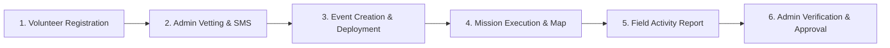

# 🚑 Philippine Red Cross Volunteer Management System

> **Connecting Compassion with Action — A GIS-Integrated Platform for Humanitarian Volunteer Management, Disaster Deployment, and Field Activity Reporting.**

[](https://www.php.net/)
[](https://www.mysql.com/)
[](https://leafletjs.com/)
[](https://www.chartjs.org/)
[-success?style=for-the-badge)]()

---

## 🎓 Academic Background

This project was conceived, designed, and developed by **college students** from the:

🏛️ **Catanduanes State University (CSU)**  
🏫 **College of Information and Communications Technology (CICT)**  
📍 *Virac, Catanduanes, Philippines*

* **Completion Date:** December 9, 2025  
* **Repository Final Integration:** September 2026  
* **Purpose:** Academic Capstone / Software Engineering Project addressing community disaster preparedness and humanitarian response workflows in the province of Catanduanes.

---

## 📖 Overview

The **Philippine Red Cross Volunteer Management System** is an end-to-end web application built to modernize and streamline volunteer mobilization, disaster response dispatching, and post-incident field reporting. Designed specifically to support local chapters such as the **Philippine Red Cross - Catanduanes Chapter**, the platform eliminates manual paperwork bottlenecks and bridges the gap between community volunteers and emergency coordinators.

From multi-step digital intake and automated SMS credential delivery to geospatial deployment tracking across municipalities (Virac, San Andres, Pandan, Bato, San Miguel, etc.), this system provides emergency response teams with real-time operational visibility and accountability.

---

## 🎯 Why Use This App? (User Benefits)

### 👥 Target Users
* **Chapter Administrators & Disaster Relief Coordinators:** Personnel responsible for vetting volunteer applications, organizing relief drives, dispatching teams to affected zones, and reviewing mission activity reports.
* **Community Volunteers, Youth Leaders & College Students:** Civic-minded individuals looking for a transparent, organized way to register, view active deployments, receive emergency notices, and submit field documentation.

### 💡 Main Problems Solved
* 📋 **Paper-Heavy Registration & Lost Documents:** Eliminates physical forms and lost folders by offering structured digital registration capturing personal data, blood types, medical flags, emergency contacts, skills, and PDF/image identification.
* 🗺️ **Geographic Blind Spots During Emergencies:** In typhoon-prone regions like Catanduanes, coordinators often struggle to locate where responders are stationed. An interactive GIS map pinpoints municipal deployment zones, event venues, and volunteer headcounts in real time.
* 🔐 **Manual Credential Bottlenecks:** Coordinators no longer need to manually draft emails or paper notices. Approving an applicant automatically generates high-entropy credentials and instantly dispatches them to the volunteer's phone via SMS.
* 📝 **Accountability & Mission Reporting:** Deployed volunteers have a secure digital portal to log service hours, write mission summaries, and upload field proof (`.pdf`, `.docx`, `.png`, `.jpg`) for official admin evaluation and verification.

---

## ✨ Key Features

### 🛡️ Administrator Command Center
* **Live Analytics Dashboard:** Visual operational metrics displaying volunteer counts, active missions, municipal distribution, and pending tasks.
* **Application Vetting & Status Control:** Inspect comprehensive volunteer dossiers and one-click approve, decline, or place applications on hold with custom remarks.
* **Automated SMS & Credential Dispatch:** Integrated SMS dispatch engine sends welcome notifications, generated usernames/passwords, and deployment alerts directly to volunteers' mobile devices.
* **Geospatial Incident & Mission Map:** Interactive OpenStreetMap/Leaflet visualization displaying municipal relief operations and deployment clusters across Catanduanes.
* **Event Coordination & Roster Deployment:** Create humanitarian missions with custom dates, descriptions, and GPS markers, then deploy available personnel with assigned roles.
* **Activity Report Review System:** Centralized review dashboard to inspect volunteer post-mission reports, review attached proof files, and formally approve or reject submissions.

### 🧑‍🤝‍🧑 Volunteer Self-Service Portal
* **Digital Profile & Service Record:** View active deployment status, personal profile details, contact information, and service history.
* **Mission Map View:** Dedicated interactive map showing assigned deployment sites, coordinates, and nearby event hubs.
* **Post-Deployment Activity Reporting:** Interactive submission module allowing volunteers to record hours rendered, describe duties performed, and attach supporting files (`.pdf`, `.doc`, `.docx`, `.png`, `.jpg`).
* **Report Tracker ("My Reports"):** Live status tracker showing pending, approved, or rejected field reports with administrator feedback notes.

---

## 🛠️ Tech Stack

| Category | Technology | Description |
| :--- | :--- | :--- |
| **Frontend** | HTML5, CSS3, Vanilla JavaScript (ES6+) | Responsive user interface, interactive forms, and dynamic DOM manipulation |
| **Backend** | PHP (Procedural & Object-Oriented APIs) | Business logic, session authentication, file processing, and REST-style endpoints |
| **Database** | MySQL / MariaDB (`mysqli`) | Relational database schema with prepared statements for SQL injection defense |
| **Mapping & GIS** | [Leaflet.js](https://leafletjs.com/) & OpenStreetMap | Geospatial visualization of municipal deployment markers and coordinates |
| **Data Visualization** | [Chart.js](https://www.chartjs.org/) | Dynamic bar charts, doughnut statistics, and live dashboard counters |
| **Messaging** | iTexMo SMS Gateway API | Automated cellular notifications for credentials and deployment alerts |
| **Runtime Environment** | Apache (XAMPP / LAMP / WAMP) | Local server hosting and web deployment |

---

## 🔄 How to Use the System (Workflow)



1. **Volunteer Registration:**
   * An applicant visits `register.php` and completes the digital registration form (personal data, educational background, medical notes, emergency contacts, skills, and verification documents).
2. **Administrator Vetting & Credential Generation:**
   * The coordinator logs into `login.php`, navigates to **Volunteers** (`volunteers.php`), and reviews the applicant's profile and documents.
   * Upon clicking **Accept**, the backend triggers `utility/updateVolunteerStatus.php`, creating an account and sending an automated SMS to the volunteer with their temporary login credentials.
3. **Event Planning & Deployment Assignment:**
   * The administrator creates a disaster relief or community event under **Events** (`events.php`) with specified geographic coordinates.
   * Personnel are deployed to the event with assigned roles via `utility/deployVolunteer.php`.
4. **Mission Execution & GIS Tracking:**
   * Volunteers log in to `profile/profile.php` and view mission details.
   * Both coordinators and volunteers track active missions on the interactive map (`profileMap.php` / `map.php`).
5. **Post-Deployment Activity Reporting:**
   * After concluding field work, the volunteer visits `profile/activityReport.php`, selects their completed deployment, logs hours rendered, writes a mission summary, and uploads supporting field evidence (`.pdf`, `.docx`, images).
6. **Administrator Review & Verification:**
   * Administrators review submitted reports in `adminActivityReports.php`, view submitted documentation, and assign an **Approved** or **Rejected** status with evaluator feedback.

---

## 💻 Installation & Setup Instructions

Follow these steps to set up and run the application on your local machine using **XAMPP** (or any LAMP/WAMP environment).

### 1. Prerequisites
* [XAMPP](https://www.apachefriends.org/) (with **Apache** and **PHP 7.4+** or **PHP 8.x**)
* **MySQL / MariaDB**
* Modern Web Browser (Chrome, Firefox, Edge)
* Git installed

### 2. Clone the Repository
Clone the repository directly into your web server root (e.g., `C:/xampp/htdocs/` on Windows):

```bash
cd C:/xampp/htdocs/
git clone https://github.com/JAPEE45/Volunteer-WebApp.git
```

### 3. Setup the Database
1. Launch **XAMPP Control Panel** and start **Apache** and **MySQL**.
2. Open your browser and navigate to **phpMyAdmin**:
   ```
   http://localhost/phpmyadmin/
   ```
3. Create a new database named:
   ```sql
   volunteer-web
   ```
4. Click on the newly created `volunteer-web` database, go to the **Import** tab, and import:
   * 📄 [`volunteer-web (7).sql`](file:///C:/xampp/htdocs/Volunteer-WebApp/volunteer-web%20%287%29.sql) *(Latest comprehensive schema and data)*
5. *(Optional)* If testing the activity reports module separately, you may also review [`database_activity_reports.sql`](file:///C:/xampp/htdocs/Volunteer-WebApp/database_activity_reports.sql).

### 4. Configure Database Credentials
Verify your database connection settings in [`utility/db.php`](file:///C:/xampp/htdocs/Volunteer-WebApp/utility/db.php):

```php
<?php
$host = "localhost";
$user = "root";       // Default XAMPP username
$pass = "";           // Default XAMPP password (leave empty)
$dbname = "volunteer-web";

$conn = new mysqli($host, $user, $pass, $dbname);

if ($conn->connect_error) {
    die("Connection failed: " . $conn->connect_error);
}
?>
```

### 5. Configure File Upload Permissions
Ensure that the `uploads/` and `uploads/activity_reports/` folders exist and are writable by the web server.

### 6. Run the Application
Open your browser and navigate to:
```
http://localhost/Volunteer-WebApp/index.php
```
* **Landing Page:** `http://localhost/Volunteer-WebApp/landingPage.php`
* **Sign In:** `http://localhost/Volunteer-WebApp/login.php`
* **Volunteer Registration:** `http://localhost/Volunteer-WebApp/register.php`

---

## 🔒 Security Best Practices Implemented
* **SQL Injection Prevention:** Parameterized SQL queries using `mysqli` prepared statements across all API endpoints.
* **Session Protection:** Role-based access control checks (`$_SESSION['user_type']`) guarding admin and volunteer routes.
* **Sanitized File Uploads:** Server-side file extension, MIME type, and size validation on user document submissions.
* **API Error Encapsulation:** Clean JSON responses for client-side consumption without revealing underlying server stack traces.

---

## 👥 Contributors & Acknowledgements

* **Student Developers:** College of Information and Communications Technology (CICT), Catanduanes State University (CSU)
* **Partner Organization Reference:** Philippine Red Cross (PRC)
* **Icons & Maps:** [Font Awesome](https://fontawesome.com/), [Leaflet](https://leafletjs.com/), [OpenStreetMap](https://www.openstreetmap.org/)
